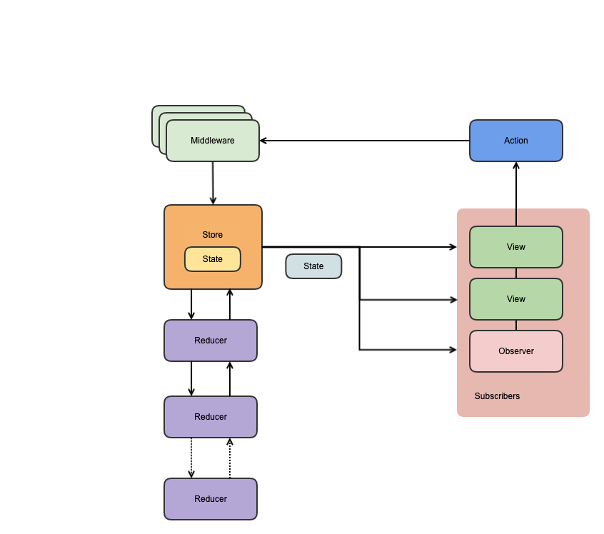

# ReduxDemo


参照[ReSwift](https://github.com/ReSwift/ReSwift)改写的Objective-C版本Redux。

## Demo工程演示

1. `git clone https://github.com/DanboDuan/ReduxDemo.git`
2. `cd ReduxDemo/Eample`
3. `pod install`
4. `open ReduxDemo.xcworkspace`


## Swift vs Objective-C

在把[ReSwift](https://github.com/ReSwift/ReSwift)改成`Objective-C`版的过程中一些个人体验。

* Swift泛型更加强大
* Swift闭包更加强大
* 但是Swift复杂闭包嵌套可读性比较差（个人理解，不寻求认同）

## Redux




1. 单一数据源
2. State 是只读的
3. 使用纯函数来执行修改

## 使用

* 直接copy代码，并用你的项目前缀重命名文件、类和协议。

### Tip

1. 请参考Demo
2. 异步操作参照[Thunk](Docs/Thunk.md)

## 核心概念

1. State

	- State应用程序状态,或者说数据，Model。
	- State是只读的，且Immutable
	- 唯一改变 state 的方法就是触发 action

	
3. Action

	- Action 是一个用于描述已发生事件的普通对象
	- Action 不能修改State ，Action 描述一个行为然后经过 Reducer 修改 State

	
2. Store

	- 维护应用 State 并支持访问 State
	- 一个 State 存在唯一的一个 Store 中
	- 支持 Subscribers 订阅 Store 的变更
	- 支持监听 Action 的分发，更新状态


4. Reducer

	- 纯函数，接收先前的 State 和 Action，并返回新的 State。  
	- Reducer描述 Action 如何改变 State 的，这也是State唯一会发生变化的地方。  
	- 一个Store可以有多个Reducer来处理Action和State
	- 一个Reducer可以处理多个Action，一个Action也可以经过处理多个Reducer处理


5. Middleware

	- 在 Action 达到 Store 之前的中间层，可以做一些额外的操作 
	- 不可以修改 State
	
6. Subscribers

	- 通过 Store 来 订阅 State 的变化
	- 接受 State 变化的通知并做相应的展示
	- Subscribers 可以是一个View，ViewController 或者一个普通的 Obeserver

## 优势

1. 状态管理，统一维护管理应用状态
2. 某一状态只有一个可信数据来源
3. 可预测性, 一个 State 经过一个 Action 在 某个 Reducer 中更新后会变成什么样
4. 可追溯，可重演
5. 适用场景：多交互、多数据源

## 缺点

1. 结构复杂，代码量增加，简单的场景其实不需要 Redux
2. 性能问题

## Demo Code

### CounterDemo

这个案例比较简单，但是已经具备了Redux的绝大部分核心组件。

##### Action

两个Action，描述数字增加or减小

```Objective-C
@interface CounterIncrAction : NSObject<Action>
@end

@interface CounterDecrAction : NSObject<Action>
@end
```
##### CounterState

数字当前的状态

```Objective-C
@interface CounterState : NSObject<State>

@property (nonatomic, assign, readonly) NSInteger number;

+ (instancetype)stateWithNumber:(NSInteger)number;

@end
```
##### CounterReducer

纯函数，根据输入的action和state返回更新后的state

```Objective-C
Reducer CounterReducer = ^CounterState * (id<Action> action, CounterState *state) {
    if (state == nil) {
        return [CounterState stateWithNumber:0];
    }

    if ([action isKindOfClass:[CounterIncrAction class]]) {
        return [CounterState stateWithNumber:state.number + 1];
    }

    if ([action isKindOfClass:[CounterDecrAction class]]) {
        return [CounterState stateWithNumber:state.number - 1];
    }

    return state;
};
```

##### Subscriber

接受CounterState更新，并展示出来。  

由于demo简易，直接在CounterViewController中创建 Store

```Objective-C
@interface CounterViewController () <Subscriber>
- (void)updateState:(CounterState *)state;
@end

@implementation CounterViewController

- (instancetype)init {
    self = [super init];
    if (self) {
        self.store = [[Store alloc] initWithReducer:CounterReducer
                                              state:[CounterState stateWithNumber:12]
                                        middlewares:@[ActionLogger, StateLogger] /*autoSkipRepeats:NO*/];
        // if autoSkipRepeats NO, the same number with state will repeatly callback
    }
    return self;
}

- (void)buttonClick:(UIButton *)sender {
    NSString *type = sender.currentTitle;
    if ([type isEqualToString:@"-"]) {
        [self.store dispatch:[CounterDecrAction new]];
    } else {
        [self.store dispatch:[CounterIncrAction new]];
    }
}

- (void)viewDidLoad {
    [super viewDidLoad];
    [self.store subscribe:self];
}

- (void)updateState:(CounterState *)state {
    self.label.text = [NSString stringWithFormat:@"%zd",state.number];
}

```

##### Middleware 比如打印日志

```Objective-C
Middleware ActionLogger = ^DispatchFunctionChain (DispatchFunction dispatch, GetState getState) {  
    return ^DispatchFunction (DispatchFunction next) { 
        return ^(id<Action> action) { 
            printf("\nACTION %s\n", [action description].UTF8String);
            next(action);
            return action;
        }; 
    }; 
};

Middleware StateLogger = ^DispatchFunctionChain (DispatchFunction dispatch, GetState getState) {  
    return ^DispatchFunction (DispatchFunction next) { 
        return ^(id<Action> action) { 
            next(action);
            printf("\nSTATE %s\n", [getState() description].UTF8String);
            return action;
        }; 
    }; 
};
```

### 实际应用Tip

1. 整个App可以共用一个 Store 也可以每个模块单独使用一个 Store，但是每个Store都只有唯一一个 State
2. State 可以简单也可以复杂
3. Subscribers 可以订阅完整的 State 也可以订阅 State 的某一部分，或者某个Transform

## Finished

* State
* Action
* Store
* Middleware
* [Thunk](Docs/Thunk.md)

## TODO

* combineReducers
* [reduceReducers](https://github.com/redux-utilities/reduce-reducers)
* Scheduled Dispatch
* [ReSwift-Router](https://github.com/ReSwift/ReSwift-Router)
* [ReSwift-Recorder](https://github.com/ReSwift/ReSwift-Recorder)

## 参考

1. [ReSwift](https://github.com/ReSwift/ReSwift)
2. [Redux 核心概念](https://www.jianshu.com/p/3334467e4b32)
2. [Redux](http://cn.redux.js.org/)

## 协议

使用 MIT 协议，详情见[LICENSE](LICENSE)文件。
